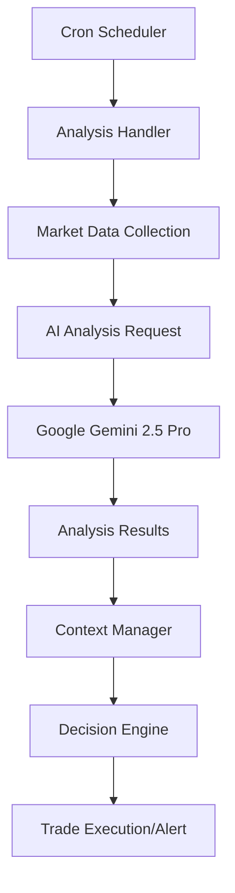
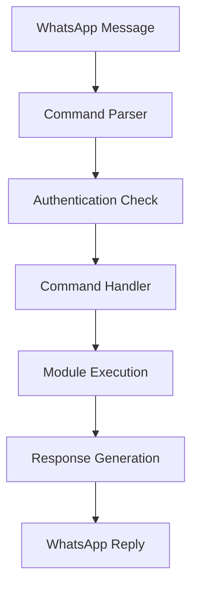
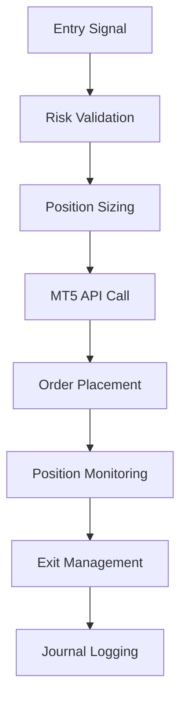

# 🏗️ System Architecture

## 🔧 Technology Stack

### Backend Core
- **Node.js** - Runtime environment
- **JavaScript ES6+** - Main programming language
- **cron** - Job scheduling
- **fs/promises** - File system operations
- **path** - File path utilities

### External APIs
- **Google Gemini 2.5 Pro** - AI analysis engine
- **WhatsApp Web.js** - WhatsApp integration
- **MetaTrader 5** - Trading platform integration
- **Google Sheets API** - Data logging & tracking

### Database & Storage
- **JSON Files** - Configuration & cache storage
- **File System** - Analysis results & logs
- **Google Sheets** - Trade journaling & reporting

---

## 📊 System Components

### 1. Core Application (`index.js`)
```javascript
Main Application Flow:
├── Environment Setup (.env loading)
├── WhatsApp Client Initialization
├── Global Settings Configuration
├── Message Event Handlers
├── Cron Job Schedulers (PO3 Stages)
└── Error Handling & Logging
```

### 2. Module System (`modules/`)
```
📁 modules/
├── analysisHandler.js      # AI analysis orchestration
├── brokerHandler.js        # MT5 trading operations
├── commandHandler.js       # WhatsApp command processing
├── contextManager.js       # Daily trading context
├── journalingHandler.js    # Trade logging & journaling
├── logger.js              # Centralized logging system
├── monitoringHandler.js   # Position monitoring & management
├── whatsappClient.js      # WhatsApp client setup
└── analysis/              # Analysis sub-modules
    ├── helpers.js         # Utility functions
    ├── priceAnalysis.js   # Price action analysis
    └── technicalAnalysis.js # Technical indicators
```

### 3. Configuration System (`config/`)
```
📁 config/
├── api_key_status.json    # API status & usage tracking
├── bot_status.json        # Bot operational status
├── google-credentials.json # Google service account
└── recipients.json        # WhatsApp notification list
```

### 4. AI Prompt System (`prompts/`)
```
📁 prompts/
├── prompt_stage1_bias.txt        # Daily bias analysis
├── prompt_stage1_extractor.txt   # Stage 1 data extraction
├── prompt_stage2_extractor.txt   # Stage 2 data extraction
├── prompt_stage2_manipulation.txt # Manipulation detection
├── prompt_stage3_entry.txt       # Entry confirmation
├── prompt_extractor.txt          # General data extraction
└── prompt_hold_close.txt         # EOD hold/close analysis
```

### 5. MetaTrader 5 API (`python api mt5/`)
```
📁 python api mt5/
├── app.py                 # Flask main application
├── auth.py               # Authentication middleware
├── constants.py          # MT5 constants & enums
├── lib.py               # Core MT5 operations
├── requirements.txt      # Python dependencies
├── swagger.py           # API documentation
└── routes/              # API endpoints
    ├── data.py          # Market data endpoints
    ├── error.py         # Error handling
    ├── health.py        # Health check endpoint
    ├── history.py       # Historical data
    ├── order.py         # Order management
    ├── order_status.py  # Order status tracking
    ├── position.py      # Position management
    └── symbol.py        # Symbol information
```

---

## 🔄 Data Flow Architecture

### 1. Analysis Pipeline


### 2. Command Processing Flow


### 3. Trade Execution Flow


---

## 🔌 API Integration

### Google Gemini 2.5 Pro Integration
```javascript
// Example API call structure
const analysisRequest = {
  model: "gemini-2.5-pro",
  prompt: stageSpecificPrompt,
  temperature: 0.1,
  maxTokens: 4096,
  context: previousAnalysisContext
};
```

### MetaTrader 5 API Integration
```python
# Flask API endpoints
/api/health          # System health check
/api/positions       # Get open positions
/api/orders          # Order management
/api/history         # Historical data
/api/symbols         # Symbol information
/api/data           # Market data
```

### WhatsApp Integration
```javascript
// WhatsApp Web.js integration
const client = new Client({
  authStrategy: new LocalAuth(),
  puppeteer: { headless: true }
});

// Message handling
client.on('message', async (message) => {
  await commandHandler.process(message);
});
```

---

## 📁 File Structure & Storage

### Analysis Cache Structure
```
📁 analysis_cache/
├── daily_news.json        # Economic news cache
├── last_result_DXY.json   # DXY analysis cache
└── [PAIR]_analysis.json   # Per-pair analysis cache
```

### Daily Context Structure
```
📁 daily_context/
├── USDJPY.json            # USDJPY daily context
├── USDCHF.json            # USDCHF daily context
├── GBPUSD.json            # GBPUSD daily context
└── context_template.json  # Template untuk pair baru
```

### Pending Orders Structure
```
📁 pending_orders/
├── trade_USDJPY.json      # USDJPY pending trades
├── trade_USDCHF.json      # USDCHF pending trades
└── trade_GBPUSD.json      # GBPUSD pending trades
```

---

## ⚡ Performance Optimization

### Caching Strategy
- **Analysis Results**: Cache selama 30 menit
- **Market Data**: Cache selama 5 menit
- **News Data**: Cache selama 1 jam
- **Context Data**: Persist until next day

### Resource Management
- **Memory Usage**: Monitor heap usage
- **API Rate Limiting**: Track API calls per minute
- **File I/O**: Batch file operations
- **Network Requests**: Connection pooling

### Scalability Considerations
- **Horizontal Scaling**: Multiple bot instances
- **Load Balancing**: Distribute API calls
- **Database Migration**: From JSON to PostgreSQL
- **Microservices**: Split into smaller services

---

## 🛡️ Security Architecture

### Authentication Layers
1. **WhatsApp Authentication**: QR code + session validation
2. **MT5 Authentication**: Username/password + server validation
3. **Google API Authentication**: Service account + OAuth2
4. **Internal Authentication**: Recipient whitelist validation

### Data Security
- **Sensitive Data**: Environment variables for secrets
- **API Keys**: Encrypted storage
- **Trade Data**: Local encryption
- **Communication**: HTTPS/WSS protocols

### Error Handling
```javascript
// Global error handler structure
try {
  await executeTradeLogic();
} catch (error) {
  logger.error('Trade execution failed', error);
  await notifyAdministrator(error);
  await gracefulRecovery();
}
```

---

## 📊 Monitoring & Logging

### Logging Levels
- **ERROR**: Critical failures yang perlu immediate action
- **WARN**: Issues yang perlu attention tapi tidak critical
- **INFO**: General information tentang bot operations
- **DEBUG**: Detailed information untuk troubleshooting

### Health Monitoring
```javascript
// Health check components
const healthChecks = {
  whatsappConnection: () => client.info.connected,
  mt5Connection: () => mt5API.ping(),
  googleAI: () => googleAI.status(),
  diskSpace: () => fs.stats('/').free > minRequired,
  memoryUsage: () => process.memoryUsage().heapUsed < maxHeap
};
```

### Performance Metrics
- **Response Time**: API call latencies
- **Success Rate**: Successful operations percentage
- **Error Rate**: Failed operations percentage
- **Resource Usage**: CPU, Memory, Disk, Network

---

## 🔄 Deployment Architecture

### Development Environment
```
Local Development:
├── Node.js Runtime
├── MetaTrader 5 Desktop
├── WhatsApp Web Browser
└── Development Database
```

### Production Environment (Pterodactyl)
```
Production Deployment:
├── Containerized Node.js Application
├── VPS with MetaTrader 5
├── Automated Restart Handling
├── Log Aggregation
└── Monitoring Dashboard
```

### CI/CD Pipeline
```
Deployment Flow:
GitHub → Pterodactyl → VPS → Production Bot
├── Automated Testing
├── Configuration Validation
├── Dependency Installation
└── Service Restart
```

---

**[⬅️ Strategy](./STRATEGY.md)** | **[➡️ API Reference](./API.md)**
